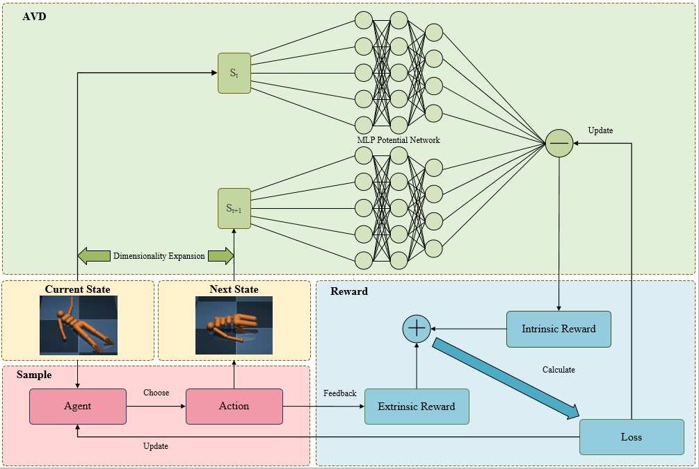
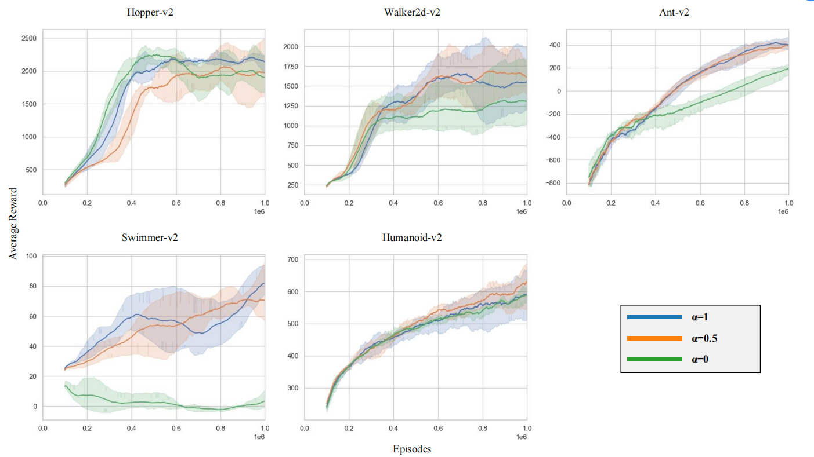

# Continuous Reinforcement Learning via Advantage Value Difference Reward Shaping: A Proximal Policy Optimization Perspective
## Framework



## Result



## Requirements

- python==3.7.16
- cuda-10.0
- pytorch==1.2.0
- gym==0.12.5
- gym[all]
- mujoco-py==1.50.1.56
- mpi4py
- pillow
- tqdm
- opencv-python
- couldpickle


## Installation
1. Please install the required packages in the above list.  
2. Install `utils`:
```bash
pip install -e .
```


